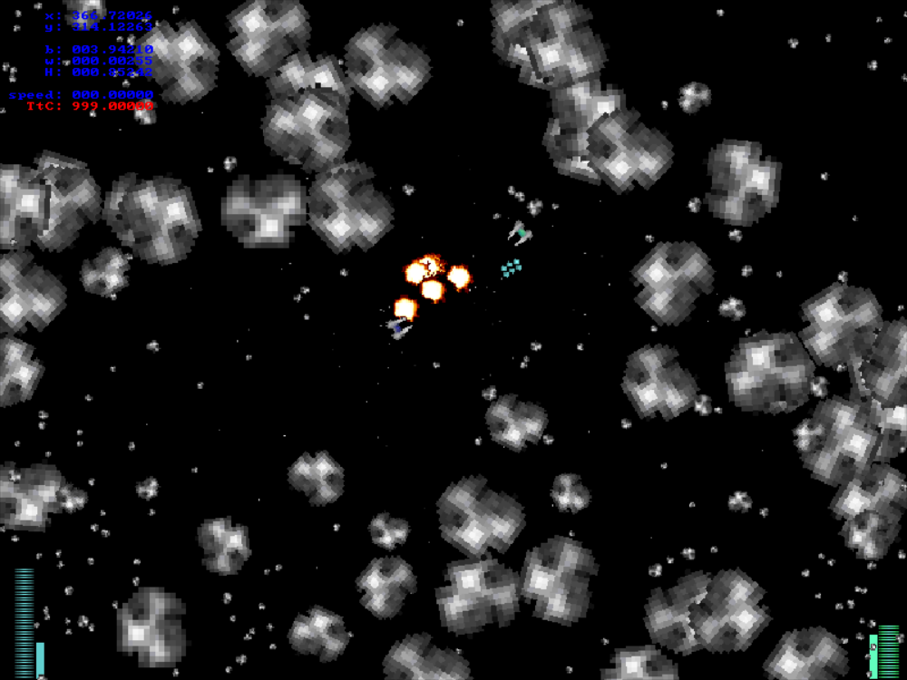

## Asteroids Game
#### Made with Allegro game programming library.

- Download [prebuilt Windows binaries](Asteroid.zip).
- View [C++ source code](https://github.com/Leftium/asteroid)

### Controls:

- `ESC`: exit
- **Green Player:**
  - `LEFT`: turn left
  - `RIGHT`: turn right
  - `UP`: thrust
  - `DOWN`: reverse
  - `SPACE`: fire
- **Blue Player:**
  - `A`: turn left
  - `D`: turn right
  - `W`: thrust
  - `S`: reverse
  - `TAB`: fire

### Notes:

The stats in the upper left are for the green ship.

- "TtC" is the "Time to Collision" between the two ships based on the current positions and velocities.
- "b" is bearing, or the direction the ship is *facing* (radians).
- "w" is angular momentum
- "H" is heading, or the direction the ship is *moving* (radians).

